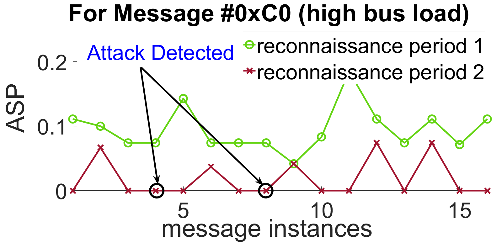
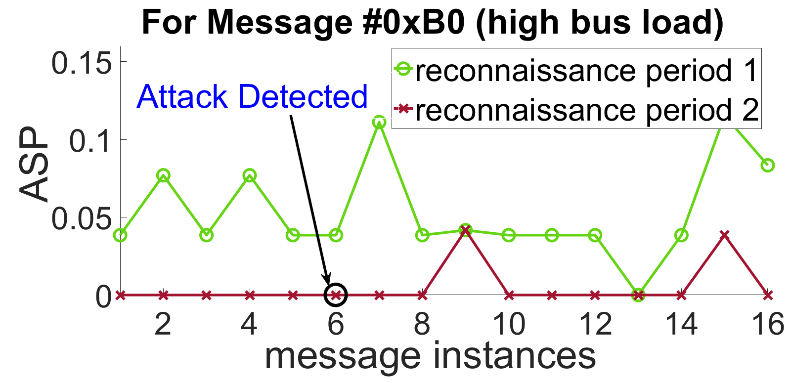
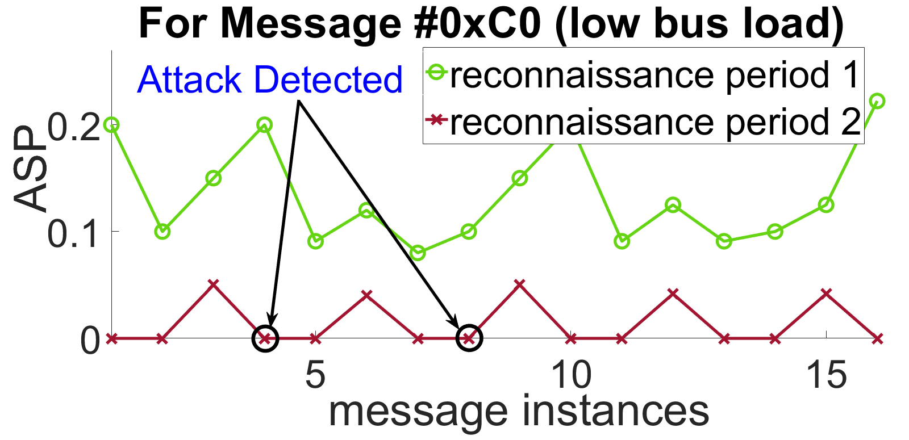

# Hide-n-Seek
- ## Results for 500kbps baud rate in the presence of High CAN traffic load
  ### ASP Experiment on #C0
    
  ### ASP Experiment on #B0
    
  ### ASP Experiment on #C4
    


- ## Results for 500kbps baud rate in the presence of Low CAN traffic load
  ### ASP Experiment on #C0
    
  ### ASP Experiment on #B0
    
  ### ASP Experiment on #C4
    

- Notice that compared to the first reconnaissance period (in green), how significantly the Attack Success Probability (ASP) reduces during the second reconnaissance period (in red).
- During the application of _Obfuscation Policy 1_, the attacker's attack attempt gets detected (red circles).

- [CAN traffic](https://github.com/Ipsitakoley/Hide-n-Seek-RTAS/tree/main/CANlog) from our real-time setup.

- ## Effect of ```AAwSOS``` on A calibrated Vehicle model Adaptive Cruise Controller : Delayed Bus-off + Detection

    [](https://github.com/Ipsitakoley/Hide-n-Seek-RTAS/assets/6061264/01ce8536-5bec-4287-a48c-ebe783a3a1a2)


  


  
